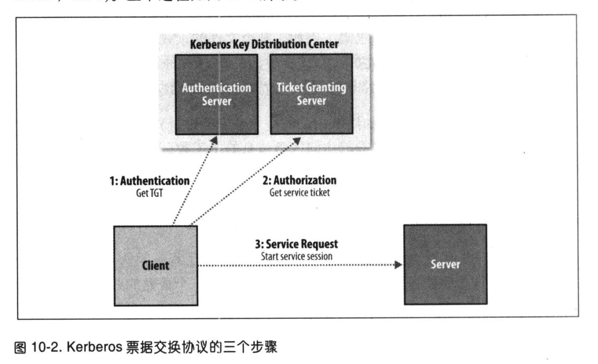

# [hadoop](http://hadoop.apache.org)

## 简介

## MapReduce

* MapReduce任务过程分为两个处理阶段：map阶段和reduce阶段。每阶段都以键-值对作为输入和输出，其类型由程序员来选择。
* map函数的输出经由MapReduce框架处理后，最后发送到reduce函数。这个处理过程基于键来对键-值对进行排序和分组【shuffle】。
* job->task->map & reduce 
* Hadoop将MapReduce的输入数据划分成等长的小数据块，称为输入分片(input split)或简称“分片”。Hadoop为每个分片构建一个map任务，并由该任务来运行用户自定义的map函数从而处理分片中的每条记录。分片不能太大也不能太小。管理分片的总时间和构建map任务的总时间将决定作业的整个执行时间。对于大多数作业来说，一个合理的分片大小趋向于HDFS的一个块的大小，默认是128MB。
* Hadoop在存储有输入数据(HDFS中的数据)的节点上运行map任务，可以获得最佳性能，因为它无需使用宝贵的集群带宽资源。这就是所谓的“数据本地化优化”(data locality optimization)。
* map任务将其输出写入本地硬盘，而非HDFS。【因为map的输出是中间结果：该中间结果由reduce任务处理后才产生最终输出结果，而且一旦作业完成，map的输出结果就可以删除。因此，如果把它存储在HDFS中并实现备份，难免有些小题大做。如果运行map任务的节点在将map中间结果传送给reduce任务之前失败，Hadoop将在另一个节点上重新运行这个map任务以再次构建map中间结果】
* reduce的输出通常存储在HDFS中以实现可靠存储。【对于reduce输出的每个HDFS块，第一个副本存储在本地节点上，其他副本出于可靠性考虑存储在其他几家的节点中】
* reduce任务的数量并非由输入数据的大小决定，相反是独立制定的。
* 如果有到多个任务，每个任务就会针对输出进行分区(partition)，即为每个reduce建一个分区。每个分区有有许多键及对应的值，但每个键对应的键-值对记录都在同一分区中。分区可由用户定义的分区函数控制，但通常情况默认的partitioner通过哈希函数来分区，很高效。
* 有reduce任务就存在shuffle【map和redeuce中间的数据流】，没有reduce的时候，唯一的非本地节点数据传输是map任务将结果写入HDFS。

* combiner函数能帮助减少mapper和reducer之间的数据传输量【集群上的可用带宽限制了MapReduce作业的数量，因此尽量避免map和reduce人物之间的数据传输是有利的】，但是combiner函数不能取代reduce函数，因为我们仍然需要reduce函数来处理不通map输出中具有相同键的记录。

## Hadoop分布式文件系统

* 分布式文件系统：管理网络中跨多台计算机存储的文件系统。
* HDFS，简称DFS，以流式数据访问模式来存储超大文件，运行于商用硬件集群上。

    1. 超大文件
    2. 流式数据访问--一次写入，多次读取是最高效的使用方式。数据机通常由数据源生成或从数据源复制而来，接着长时间在此数据集上进行各种分析。每次分析都将设计该数据集的大部分数据甚至全部，因此读取整个数据集的时间延迟比读取第一条记录的时间延迟更重要。
    3. 商用硬件--Hadoop 并不需要运行在昂贵且高可靠的硬件上，它是设计运行在商用硬件的集群上的。
    4. 低时间延迟的数据访问--HDFS是为高数据吞吐量应用优化的，要求低时间延迟数据访问的应用不适合在HDFS上运行。
    5. 大量的小文件--由于namenode将文件系统的元数据存储在内存中，因此该文件系统所能存储的文件总数受限于namenode的内存容量.根据经验，每个文件、目录和数据块的存储信息大约占150字节。
    6. 多用户写入，任意修改文件--HDFS中的文件写入只支持单个写入者，而且写操作总是以“只添加”方式在文件末尾写数据。不支持多个写入者的操作，也不支持在文件的任意位置进行修改。

* HDFS中的块(block)，默认为128MB。HDFS上的文件被划分为块大小的多个分块(chunk)，作为独立的存储单元。HDFS中小于一个块大小的文件不会占据整个块的空间。
* HDFS的块比磁盘的块大，其目的是为了最小化寻址开销。如果块足够大，从磁盘传输数据的时间会明显大于定位这个块开始位置所需的时间。因而，传输一个由多个块组成的大文件的时间取决于磁盘传输速率。
* MapReduce中的map任务通常一次只处理一个块中的数据
* 对分布式文件系统中的块进行抽象的好处

    1. 一个文件的大小可以大于网络中任意一个磁盘的容量。
    2. 使用抽象块而非整个文件作为存储单元，大大简化了存储子系统的设计。
    3. 非常适合用于数据备份进而提供数据容错能力和提高可用性。

* HDFS集群有两类节点以管理节点-工作节点模式运行，及一个namenode(管理节点)和多个datanode(工作节点)。
* namenode管理文件系统的命名空间，它维护着文件系统书及整棵树内所有的文件和目录。这些信息以两个文件形式永久保存在本地磁盘上：命名空间镜像文件和编辑日志文件。namenode也记录着每个文件中各个块所在的数据节点信息，但它并不永久保存块的位置信息，因为这些信息会在系统启动时根据节点信息重建。
* datanode是文件系统的工作节点。它们根据需要存储并检索数据块(受客户端或namenode调度),并且定期向namenode发送它们所存储的块的列表。 
* Hadoop为namenode的容错提供了两种机制

    1. 备份那些组成文件系统元数据持久状态的文件，Hadoop可以通过配置使namenode在多个文件系统上保存元数据的持久状态。这些写操作是实时同步的，且是原子操作。一版的配置使，将持久状态写入本地磁盘的同时，写入一个远程挂在的网络文件系统(NFS)。
    2. 运行一个辅助namenode，但它不能被用作namenode。这个辅助namenode的重要作用是定期合并编辑日志与命名空间镜像，以防止编辑日志过大。这个辅助namenode一般在另一台单独的物理计算机上运行，因为它需要占用大量CPU时间，并且需要与namenode一样多的内存来执行合并操作。它会保存合并后的命名空间镜像的副本，并在namenode发生故障时启用，但是，辅助namenode保存的状态总是滞后于主节点所以在主节点全部失效时，难免会丢失部分数据。在这种情况下一般把存储在NFS上的namenode元数据复制到辅助namenode并作为新的主namenode运行。

* 块缓存--通常datanode从磁盘中读取块，但对于访问频繁的文件，其对应的块可能被显式地缓存在datanode的内存中，以堆外块缓存(off-heap block cache)的形式存在。默认情况下，一个块仅缓存在一个datanode的内存中，当然可以针对每个文件配置datanode的数量。作业调度器通过在缓存块的datanode上运行任务，可以利用块缓存的优势提高读操作的性能。eg:连接(join)操作中使用的一个小的查询表就是块缓存的一个很好的候选。
* 用户或应用通过在缓存池(cache pool)中增加一个cache directive来告诉namenode需要缓存哪些文件及缓存多久。缓存池是一个用于管理缓存权限和资源使用的管理性分组。
* namenode 在内存中保存文件系统中每个文件和每个数据块的引用关系，这意味着对于一个拥有大量文件的超大集群来说，内存将成为限制系统横向扩展的瓶颈。
* 联邦HDFS--联邦HDFS允许系统通过添加namenode实现扩展，其中每个namenode管理文件系统命名空间的一部分【/user,/share,...】。在联邦环境下，每个namenode维护一个命名空间卷(namespace volume)，由命名空间的元数据和一个数据块池(block pool)组成，数据块池包含该命名空间下文件的所有数据块。命名空间卷之间是相互独立的，两两之间并不相互通信，甚至其中一个namenode的实效也不会影响由其他namenode维护的命名空间的可用性。数据块池不再进行切分，因此集群中的datanode需要注册到每个namenode，并且存储着来自多个数据块池中的数据块。
* Hadoop2配置了一堆活动-备用(active-standby)namenode来支持HDFS的高可用性(HA)。
* 两种高可用性共享存储方案：NFS过滤器或群体日志管理器(QJM, Quorum Journal Manager)。QJM是一个专用的HDFS实现，为提供一个高可用的编辑日志而设计，被推荐用于大多数HDFS部署中。
* 系统中有一个称为故障转移控制器(failover controller)的新实体，管理者将活动namenode转换为备用namenode的转换过程。有多种故障转移控制器，但默认的一种是使用了ZooKeeper来确保有且仅有一个活动namenode。每一个namenode运行着一个轻量级的故障转移控制器，其工作就是监视诉诸namenode是否失效(通过一个简单的心跳机制实现)并在namenode失效时进行故障切换。
* fs.defaultFS(core-site.xml)，用于设置Hadoop的默认文件系统，eg：hdfs://localhost/  填写uri时可省略
* dfs.replication(hdfs-site.xml)，用于设置HDFS文件系统块的副本数量。

        hadoop fs -ls hdfs://mycluster/user/hive/warehouse/guosq_test.db
        hadoop fs -mkdir /user/guosq  等价于  hadoop fs -mkdir hdfs://mycluster/user/guosq
        hadoop fs -ls /user  等价于  hadoop fs -ls hdfs://mycluster/user
        hadoop fs -copyFromLocal /home/admin/guosq/start-spark-sql.sh hdfs://mycluster/user/guosq/start-spark-sql.sh  等价于  hadoop fs -copyFromLocal /home/admin/guosq/start-spark-sql.sh /user/guosq/start-spark-sql.sh 
        hadoop fs -copyFromLocal /home/admin/guosq/start-spark-sql.sh start-spark-sql.sh  使用相对路径复制到HDFS的home目录中，本例中为/user/admin
        hadoop fs -copyToLocal start-spark-sql.sh /home/admin/guosq/start-spark-sql.copy.sh

* 以下场景，可用带宽依次递减：

    * 同一节点上的进程
    * 同一机架上的不同节点
    * 同一数据中心中不同机架上的节点
    * 不同数据中心中的节点

* Distcp 可以替代hadoop fs -cp

        hadoop distcp file1 file2
        hadoop distcp dir1 dir2
        hadoop distcp -update dir1 dir2
        hadoop distcp -overwrite file1 file2
        hadoop distcp -update -delete -p hdfs://namenode1/foo hdfs://namenode2/foo   -delete选项使得distcp可以删除目标路径中任意没在源路径中出现的文件或目录，-p选项意味着文件状态如权限、块大小和副本数被保留
        hadoop distcp  webhdfs://namenode1:50070/foo webhdfs://namenode2:50070/foo

## YARN(Yet Another Resource Negotiator)

* 资源管理器(resoure manager)：管理集群资源使用
* 节点管理器(node manager)：运行在所有节点上，能够启动和监控容器(container)
* YARN本身不会为应用的各部分(客户端、master和进程)彼此间通信提供任何手段。大多数重要的YARN应用使用某种形式的远程通信机制(例如Hadoop的RPC层)来向客户端传递状态更新和返回结果，但是这些通信机制都是专属于各应用的。
* YARN有一个灵活的资源请求模型。档请求多个容器时，可以指定每个容器需要的计算机资源数量(内存和CPU)，还可以指定对容器的本地限制要求。
* 有时本地限制无法被满足，这种情况下要么不分配资源，或者可选择放松限制。
* 通常情况下，档启动一个容器用于处理HDFS数据块(为了在MapReduce中运行一个map任务)时，应用将会向这样的节点申请容器：存储该数据块三个副本的节点，或是存储这些副本的机架中的一个节点。如果都申请失败，则申请集群中的任意节点。
* YARN应用可以在运行中的任意时刻提出资源申请。eg：可以在最开始提出所有的请求，或者为了满足不断变化的应用需要，采取更为动态的方式在需要更多资源时提出请求。Spark是采用固定的方式，MapReduce则分两步，在最开始时申请map任务容器，reduce任务容器的启用则放在后期。同样，如果任何任务出现失败，将会另外申请容器以重新运行失败的任务。
* YARN生命周期的三种模型

    1. 一个用户作业对应一个应用---MapReduce
    2. 作业的每个工作流或每个用户对话(可能并无关联性)对应一个应用。这种方法要比第一种情况效率更高，因为容器可以在作业之间崇勇，并且有可能缓存作业之间的中间数据。--Spark
    3. 多个用户共享一个长期运行的应用。这种应用通常是作为一种协调者的角色在运行。--Impala(Impala使用这种模型提供了一个代理应用，Impala守护进程通过该代理请求集群资源。由于避免了启动新application master带来的开销，一个总是开启(always on)的application master意味着用户将获得非常低延迟的查询响应)
    
* YARN的很多设计是为了解决MapReduce1的局限性。使用YARN的好处包括一下几个方面
    
    1. 可扩展性(Scalability)
    2. 可用性(Availability)
    3. 利用率(Utilization)
    4. 多租户(Multitenancy)
    
* YARN的三种调度器
    
    1. FIFO调度器(FIFO Scheduler)--先进先出，简单易懂，不需要任何配置，但是不适合共享集群
    2. 容量调度器(Capacity Scheduler)--一个独立的专门队列保证小作业一提交就可以启动
    3. 公平调度器(Fair Scheduler)--不需要预留一定量的资源，调度器会在所有运行的作业之间动态平衡资源
    
* 容量调度器允许多个组织共享一个Hadoop集群，每个组织可以分配到全部集群资源的一部分。每个组织被配置一个专门的队列，每个队列被配置为可以使用一定的集群资源。队列可以进一步按层次划分，这样每个组织内的不同用户能够共享该组织队列所分配的资源。在一个队列内，使用FIFO调度策略对应用进行调度。
* 单个作业使用的资源不会超过其队列容量。然而，如果队列中有多个作业，并且资源不够用的情况下，这时如果集群仍有可用的空闲资源，那么容量调度器可能会将空余的资源分配给队列中的作业，哪怕这会超出队列容量。这成为“弹性队列”(queue elasticity)。
* 延迟调度(delay scheduling)-- 如果等待一小段时间(不超过几秒)，能够戏剧性的增加在锁清秋的节点上分配到一个容器的机会，从而可以提高集群的效率
* 主导资源公平性(Dominant Resource Fairness, DRF)--YARN观察每个用户的主导资源，并将其作为对集群资源使用的一个度量。

## Hadoop的I/O操作

* CRC-32(32位循环冗余校验)是常用的错误检测码，任何大小的数据输入均计算得到一个32为的整数校验和。Hadoop ChecksumFileSystem使用CRC-32计算校验和，HDFS使用一个更有效的**变体CRC-32C**来确保文件的完整性。
* hadoop fs -checksum /user/guosq/start-spark-sql.sh  -- 查看某一个文件的校验和
* Hadoop 常用的压缩方法

    压缩格式|工具|算法|文件扩展名|是否可切分
    -|-|-|-|-
    DEFLATE|无|DEFLATE|.deflate|否
    gzip|gzip|DEFLATE|.gz|否
    bzip2|bzip2|bzip2|.bz2|是
    lzo|lzop|LZO|.lzo|否
    lz4|无|LZ4|.lz4|否
    Snappy|无|Snappy|.nappy|否

* 所有压缩算法都需要权衡空间/时间：压缩和解压缩速度更快，其代价通常是只能节省少量的空间。
* Codec 是压缩-解压缩算法的一种实现。在hadoop中，一个对CompressionCodec接口的实现代表一个codec。下表为Hadoop的压缩codec

    压缩格式|HadoopCompressionCodec
    -|-
    DEFLATE|org.apache.hadoop.io.compress.DefaultCodec
    gzip|org.apache.hadoop.io.compress.GzipCodec
    bzip2|org.apache.hadoop.io.compress.BZip2Codec
    LZO|com.apache.compress.lzo.LzopCodec
    LZ4|org.apache.hadoop.io.compress.Lz4Codec
    Snappy|org.apache.hadoop.io.compress.SnappyCodec

* 为了提高性能，最好使用“原生”(native)类库来实现压缩和解压缩.
* 压缩算法的原生代码库
    
    压缩格式|是否有Java实现|是否有原生实现
    -|-|-
    DEFLATE|是|是
    gzip|是|是
    bzip2|是|否
    LZO|否|是
    LZ4|否|是
    Snappy|否|是

* 默认情况下，Hadoop会根据自身运行的平台搜索原生代码库，如果找到相应的代码库就会自动加载。
* io.native.lib.available=false -- 禁用原生代码库
* CodecPool--如果使用的是原生代码库并且需要在应用中执行大量压缩和解压缩操作，可以考虑使用**CodecPool**，它支持反复使用压缩和解压缩，以分摊创建这些对象的开销。

* mapreduce.output.fileoutputformat.compress=true,mapreduce.output.fileoutputformat.compress.codec=打算使用的压缩codec的类名

    属性名称|类型|默认值|描述
    -|-|-|-
    mapreduce.output.fileoutputformat.compress|boolean|false|是否压缩输出
    mapreduce.output.fileoutputformat.compress.codec|类名称|org.apache.hadoop.io.compress.DefaultCodec|map输出所用的压缩codec
    mapreduce.output.fileoutputformat.compress.type|String|RECORD|顺序文件输出可以使用的压缩类型：NONE、RECORD或者BLOCK

* 尽管MapReduce应用读/写的是未经压缩的数据，但如果对map阶段的中间输入进行压缩，也可以获得不少好处。由于map任务的输出需要写到磁盘并通过网络传输到reducer节点，所以通过使用LZO、LZ4或者Snappy这样的快速压缩方式，是可以获得性能提升的，因为需要传输的数据减少了。启用map任务输出压缩和设置压缩格式的配置属性如表所示：

    属性名称|类型|默认值|描述
    -|-|-|-
    mapreduce.map.output.compress|boolean|false|是否对map任务输出进行压缩
    mapreduce.map.output.compress.codec|Class|org.apache.hadoop.io.compress.DefaultCodec|map输出所用的压缩codec

* 序列化(serialization)：将结构化对象转化为字节流以便在网络上传输或写到磁盘进行永久存储的过程。
* 凡序列还(deserialization)：将字节流转回结构化对象的逆过程。
* 序列化用于分布式数据处理的两大领域：进程间通信和永久存储。
* 在Hadoop中，系统中多个节点上进程间的通信是通过“远程过程调用”(RPC, remote procedure call)实现的。RPC协议将消息序列化成二进制流后发送到远程节点，远程节点接着将二进制流反序列化为原始消息。通常情况下，RPC序列化格式如下：
  * 紧凑：紧凑格式能充分利用网络带宽(数据中心最稀缺的资源)
  * 快速：进程间通信形成了分布式系统的股价，所以需要尽量减少序列化和反序列化的性能开销，这是最基本的
  * 可扩展：为了满足新的需求，协议不断变化。所以在控制客户端和服务器的过程中，需要直接引进相应的协议。
  * 支持互操作：对于某些系统来说，希望能支持以不同语言写的客户端与服务器交互，所以需要设计需要一种特定的格式来满足这一需求
* Hadoop使用的是自己的序列化格式**Writable**，它绝对紧凑、速度快，但不太容易用Java以外的语言进行扩展和使用。
* 序列化IDL(IDL, Interface Description Language-接口定义语言)。两个比较流行的序列化框架Apache Thrift 和Google 的Protocol Buffers。
* SequenceFile--适合作为日志文件的存储格式，也可以作为小文件的容器。HDFS和MapReduce是针对大文件优化的，所以通过SequenceFile类型将小文件包装起来，可以获得更高效率的存储和处理。Hadoop fs命令有一个-text选项可以以文本形式显示顺序文件。eg: hadoop fs -text -text number.seq | head
* MapFile 是已经排过序的SequenceFile，它有索引，所以可以按键查找。索引自身就是一个SequenceFile，包含了map中的一小部分键(默认情况下，是每隔128个键)。由于索引能够加载进内存，因此可以提供对主数据文件的快速查找。主数据文件则是另一个SequenceFile，包含了所有的map条目，这些条目都按照键顺序进行了排序。
* 顺序文件和map文件是Hadoop中最早的、但并不是仅有的二进制文件格式。其他有Avro数据文件。
* 顺序文件、map文件和Avro数据文件都是面向行的格式，意味着每一行的值在文件中是连续存储的。
* Hadoop中的第一个面向列的文件格式是Hive的RCFile(Record Columnar File)。

## MapReduce 应用开发

* 本地作业运行期使用单JVM运行一个作业，只要作业需要的所有类都在类路径(classpath)上，那么作业就可以正常执行。
* 在分布式环境中，开始的时候作业的类必须打包成一个作业JAR文件并发送给集群。Hadoop通过搜索驱动程序的类路径自动找到该作业JAR文件，该类路径包含JobConf或Job上的setJarByClass()方法中设置的类。另一种方法，如果你想通过文件路径设置一个置顶的JAR文件，可以使用setJar()方法。JAR文件路径可以是本地的，也可以是一个HDFS文件路径。
* mvn package -dskipTests
* mapreduce.jobhistory.done-dir 设置作业历史文件存放目录。作业的历史文件会保存一周，随后被系统删除。历史日志包括作业、任务和尝试时间，所有这些信息以JSON格式存放在文件中。

* Haoop 日志类型

    日志|主要对象|描述|更多信息
    -|-|-|-
    系统守护进程日志|管理员|每隔Hadoop守护进程产生一个日志文件(使用log4j)和另一个(文件合并标准输出和错误)。这些文件分别写入HADOOP_LOG_DIR环境变量定义的目录|
    HDFS审计日志|管理员|这个日志记录所有HDFS请求，默认是关闭状态。虽然该日志存放位置可以配置，但一般写入namenode的日志|
    Mapreduce作业历史日志|用户|记录作业运行期间发生的事件(如任务完成)。集中保存在HDFS中|
    MapReduce任务日志|用户|每隔任务子进程都用log4j产生一个日志文件(乘坐syslog)，一个保存发到标准输出(stdout)数据的文件，一个保存标准错误(stderr)的文件。这些文件写入到YARN_LOG_DIR环境变量定义的目录的userlogs的子目录中|

* YARN有一个日志聚合(log aggregattion)服务，可以取到已完成的应用的任务日志，并把其搬移到HDFS中，在那里任务日志被存储在一个容器文件中用于存档。默认关闭。
* 作业调优

范围|最佳实践|
-|-|-
mapper的数量|mapper需要运行多长时间？如果平均只运行几秒钟，则可以看是否能用更少mapper运行更长的时间，通常是一分钟左右。时间长度取决于使用的输入格式|
reducer的数量|检查使用的reducer数目是不是超过1个。根据经验，Reduce任务应运行5分钟左右，且能生产出至少一个数据块的数据|
combiner的数量|作业能否充分利用combiner来减少shuffle传输的数据量|
中间值的压缩|对map输出进行压缩几乎总能使作业执行得更快|
自定义序列|如果使用自定义的Writable对象或自定义的comparator，则必须确保已实现RawComparator|
调整shuffle|MapReduce的shuffle过程可以对一些内存管理的参数进行调整，以弥补性能的不足|

## MapReduce的工作机制

* 如果作业很小，application master会将作业和自己在同一个JVM上运行。与在一个节点上顺序运行这些任务相比，当application master判断在新的容器中分配和运行任务的开销大于并行运行他们的开销流失，就会发生这一情况。这样的作业称为**uberized**，或者作为**uber任务**运行。
* 小作业：默认情况下，小作业就是少于10个mapper且只有1个reducer且输入大小小于一个HDFS块的作业(通过设置mapreduce.job.ubertask.maxmaps、mapreduce.job.ubertask.maxreduces和mapreduce.job.ubertask.maxbytes可以改变这几个值)。必须明确启用Uber任务(对于单个作业，或者是对整个集群)，具体方法是将mapreduce.job.ubertask.enable设置为true。
* 如果作业不适合作为uber任务运行，那么application master就会为该作业中的所有map任务和reduce任务向资源管理器请求容器。首先为Map任务发出请求，该请求优先级要高于reduce任务的请求，这时因为所有的map任务必须在reduce的排序阶段能够启动前完成。知道有5%的map任务已经完成时，为reduce任务的请求才会发出。
* reduce任务能够在集群中任意位置运行，但是map任务的请求有着**数据本地化局限**。
* 在作业期间，客户端每秒钟轮询一次application master以接受最新状态(轮询间隔通过mapreduce.client.progressmonitor.pollinterval设置)。客户端也可以使用Job的getStatus()方法得到一个JobStatus的实例，后者包括作业的所有状态信息。

* Hadoop 中的失败分类：任务、application master、节点管理器和资源管理器都可能导致失败。其中，任务失败分为：**map任务或reduce任务重的用户代码抛出运行异常、任务JVM突然退出、任务长时间挂起**。
* application master 被告知一个任务尝试失败后，将重新调度该任务的执行。application master会试图避免在以前失败过的节点管理器上重新调度该任务。此外，如果一个任务失败过4次，将不会再重试。这个值是可以设置的：对于map任务，通过mapreduce.map.maxattempts属性设置；对于reduce任务，通过mapreduce.reduce.maxattempts属性控制。如果某些作业允许一部分任务失败，则可以为作业设置在不处罚作业失败的情况下允许任务失败的最大百分比，map任务为mapreduce.map.failures.maxpercent，reduce任务为mapreduce.reduce.failures.maxpercent。
* 被中止(killed)的任务尝试不会被计入任务运行尝试次数，因为尝试被中止并不是任务的过错。
* YARN中的应用程序在运行失败的时候有几次尝试机会，默认值为2，由mapreduce.am.max-attempts属性控制
* YARN对集群上运行的YARN application master的最大尝试次数加以了限制，单个的应用程序不可以超过这个限制，默认值为2，有yarn.resourcemanager.am.max-attempts属性控制
* 如果节点管理器由于崩溃或运行非常缓慢而失败，就会停止向资源管理器发送信息遨信息(或发送频率很低)。如果10分钟内(可以通过属性yarn.resourcemanager.nm.liveness-monitor.expiry-interval-ms设置，以毫秒为单位)没有收到一条心跳信息，资源管理器将会通知停止发送心跳信息的节点管理器，并且将其从自己的节点池中移除以调度启用容器。如果应用程序的失败次数过高，那么节点管理器可能会被拉黑，即使节点管理自己并没有失败过。有application master管理黑名单，对于MapReduce，如果一个节点管理器上有超过三个任务失败，application master就会尽量将任务调度到不同的节点上，用户可以通过作业属性mapreduce.job.maxtaskfailures.per.tracker设置该阈值。
* 资源管理器失败是非常严重的问题，没有资源管理器，作业和任务容器将无法启动。在默认的配置中，资源管理器是个单点故障，这时由于在机器失败的情况下(尽管不太可能发生)，所有运行的作业都失败且不能被恢复。
* MapReduce确保每隔reducer的输入都是按键排序的。系统执行排序、将map输出作为输入传给reducer的过程称为shuffle。
* map任务以**缓冲的方式写到内存并出于效率的考虑进行预排序**。

* 每个map任务都有一个唤醒内存缓冲区用于存储任务输出。在默认情况下，缓冲区的大小为100MB，值由mapreduce.task.io.sort.mb属性来控制。一旦缓冲内容打到阈值(mapreduce.map.sort.spill.percent，默认为0.80，或80%)，一个后台县城便开始把内容溢出(spill)到磁盘。在溢出写到磁盘过程中，map输出继续写到缓冲区，但如果在此期间缓冲区被填满，map会被阻塞知道写磁盘完成。溢出写过程按轮询方式将缓冲区中的内容写到mapreduce.cluster.local.dir属性在作业特定子目录下制定的目录中。
* 每次内存缓冲区达到溢出阈值，就会新建一个衣橱文件(spill file)，因此在map任务写完其最后一个输出记录之后，会有几个溢出文件。在任务完成之前，溢出文件被合并成一个已分区且已排序的输出文件。配置属性mapreduce.task.io.sort.factor控制着一次最多能合并多少流，默认值是10。
* 如果至少存在3个溢出文件(通过mapreduce.map.combine.minspills属性设置)时，则combiner就会在输出文件写到磁盘之前在此运行。如果只有1或者2个溢出文件，那么犹豫map输出规模减少，因而不值得调用combiner带来的开销，因此不会为该map输出在此运行combiner。
* 在map输出写到磁盘的过程中，可以对写数据进行压缩，这样写磁盘的速度更快，节约磁盘空间，并减少传给reducer的数据量。在默认情况下，输出是不压缩的，可以通过设置mapreduce.map.output.compress=true开启。
* map端的调优属性(以作业为单位)

    属性名称|类型|默认值|说明
    -|-|-|-
    mapreduce.task.io.sort.mb|int|100|排序map输出时所使用的内存缓冲区的大小，以兆字节为单位
    mapreduce.map.sort.spill.percent|float|0.80|map输出内存缓冲和用来开始磁盘溢出写过程的记录边界索引，这两者使用比例的阈值
    mapreduce.task.io.sort.factor|int|10|排序文件时，一次最多合并的流数。这个属性也在reduce中使用。将此值增加到100是很常见的
    mapreduce.map.combine.minspills|int|3|运行combiner所需的最少溢出文件书(如果已指定combiner)
    mapreduce.map.output.compress|Boolean|false|是否压缩map输出
    mapreduce.map.output.compress.codec|Class name|org.apache.hadiio.io.compress.DefaultCodec|用于map输出的压缩编解码器
    mapreduce.shuflle.max.threads|int|0|每个节点管理器的工作线程数，用于将map输出到reducer。这时集群范围的设置，不能由单个作业设置。0表示使用Netty默认值，即两倍于可用的处理器数
  
  总的原则--给shuffle过程尽量多提供内存空间。map函数和reduce函数在保证能够得到足够内存的条件下，应尽量少用内存，不该无限使用内存（eg，应避免在map中堆积数据）。属性mapred.child.java.opts控制运行map任务和reduce任务的JVM内存大小。在任务节点上的内存应该尽可能设置的大些。

* 在map端，可以通过避免多次溢出写磁盘来获得最佳性能，一次是最佳情况。如果能估算map输出大小，就可以合理地设置mapreduce.task.io.sort.\*属性来尽可能减少溢出写的次数。
* 在reduce端，中间数据全部驻留在内存是，就能获得最佳性能。在默认情况下，这是不可能发生的，因为所有内存一般都预留给reduce函数。但如果reduce函数的内存需求不大，把mapreduce.reduce.merge.inem.threhold设置为0，把mapreduce.reduce.input.buffer.percent设置为1.0(或一个更低的值)就可以提升性能。

* map端的调优属性

    属性名称|类型|默认值|说明
    -|-|-|-
    mapreduce.reduce.shuffle,parallelcopies|int|5|用于把map输出复制到reducer的线程数
    mapreduce.reduce.shuffle.maxfetchfailures|int|10|在声明失败之前，reducer获取一个map输出所花的最大时间
    mapreduce.task.io.sort.factor|int|10|排序文件时一次最多合并的流的数量。这个属性也在map端使用
    mapreduce.reduce.input.buffer.percent|float|0.70|在shuffle的复制阶段，分配给map输出的缓冲区占对空间的百分比
    mapreduce.reduce.shuffle.merge.percent|float|0.66|map输出缓冲区(由mapred.job.shuffle.input.buffer.percent定义)  的阈值使用比例，用于启动合并输出和磁盘溢出写的过程
    mapreduce.reduce.merge.inmem.threshold|int|1000|启动合并输出和磁盘溢出写过程的map输出的阈值数。0或更小的数意味着没有阈值限制，溢出写行为由mapreduce.reduce.shuffle.merge.percent单独控制
    mapreduce.reduce.input.buffer.percent|float|0.0|在reduce过程中，在内存中保存map输出的空间占整个堆空间的比例。reduce阶段开始时，内存中的map输出大小不能大于这个值。默认情况下，在reduce任务开始之前，所有map输出都合并到磁盘上，以便为reducer提供尽可能多的内存。然而，如果reducer需要的内存较少，可以增加此值来最小化访问磁盘的次数

* 任务执行环境的属性
  
    属性名称|类型|默认值|范例
    -|-|-|-
    mapreduce.job.id|string|作业ID|job_1592991876492_42244
    mapreduce.task.id|string|任务ID|task_1592991876492_42244_m_000000、task_1592991876492_42244_m_000001(map task)、task_1592991876492_42244_r_000000(reduce task)
    mapreduce.task.attemp.id|string|任务尝试ID|attempt_2008112011300003_m_000003_0
    mapreduce.task.partition|int|作业中任务的索引|3
    mapreduce.task.ismap|boolean|此任务是否是map任务|true

* 推测执行--Hadoop不会尝试诊断或修复执行慢的任务，相反，在一个惹怒运行比预期慢的时候，它会尽量检测，并启动另一个相同的任务作为备份，这就是所谓的任务的“推测执行”(speculative execution)。如果原任务在推测任务前完成，推测任务就会被中止；同样，如果推测任务先完成，那么原任务就会被中止。推测执行是一种优化措施，它并不能使作业的运行更可靠。在默认情况下，推测执行是启用的。可以基于集群或基于每个作业，单独为map任务和reduce任务启用或禁用该功能。相关属性如下:

    属性名称|类型|默认值|描述
    -|-|-|-
    mapreduce.map.speculative|boolean|true|如果任务运行变慢，该属性决定着是否要启动map任务的另外一个实例
    mapreduce.reduce.speculative|boolean|true|如果任务运行变慢，该属性决定着是否要启动reduce任务的另外一个实例
    Yarn.app.mapreduce.am.job.estimator.class|Class|Org.apache.hadoop.mapreduce.v2.app.speculate.DefaultSpeculator|Speculator类实现推测执行策略(  只针对MapReduce2)
    Yarn.app.mapreduce.am.job.estimator.class|Class|Org.apache.hadoop.mapreduce.v2.app.speculate.LegacyTaskRuntimeEstimator|Speculator实例使用的TaskruntimeEstimator的实现，提供任务运行时间的估计值(只针对MapReduce2)
  
## MapReduce 的类型与格式

* Hadoop的MapReduce中，map函数和reduce函数遵循如下常规格式：
    
        map:(K1, V1) -> list(K2, V2)
        reduce:(K2, list(V2)) -> list(K3, V3)

* 一般来说，map函数输入的键/值类型(K1和V1)不同于输出类型(K2和V2)。然而，reduce函数的输入类型必须与map函数的输出类型相同，但reduce函数的输出类型(K3和V3)可以不同于输入类型。
* 如果使用combiner函数，它与reduce函数(是Reducer的一个实现)的形式相同，不同之处是它的输出类型是中间的键值对类型(K2和V2)，这些中间值可以输入reduce函数:

        map:(K1, V1) -> list(K2, V2)
        combiner:(K2, list(V2)) -> list(K2, V2)
        reduce:(K2, list(V2)) -> list(K3, V3)

* combiner函数与reduce函数通常是一样的，在这种情况下，K3与K2类型相同，V3与V2类型相同
* partition函数对中间结果的键-值对(K2和V2)进行处理，并且返回一个分区索引(partition index。实际上，分区有键单独决定(值被忽略)。
* reducer增大能缩短reduce过程，但如果太大则会小文件过多，因此，合理选择reducer的个数很重要。一条经验法则是：目标reducer保持在每个运行5分钟左右、且产生至少一个HDFS块的输出比较合适。
* 分片大小的计算公式: max(mininumSize, min(maximumSize, blocksize))，在默认的情况下: minimumSize < blockSize < maximumSize
* 控制分片大小举例

    最小分片大小|最大分片大小|块的大小|分片大小|说明
    -|-|-|-|-
    1(默认值)|Long.MAX_VALUE(默认值)|128MB(默认值)|256MB|默认情况下，分片大小与块大小相同
    1(默认值)|Long.MAX_VALUE(默认值)|256MB|256MB|增加分片大小最自然的方法是提供更大的HDFS块，通过dfs.blocksize或在构建文件时以单个文件为基础进行设置
    256MB|Long.MAX_VALUE(默认值)|128MB(默认值)|256MB|通过使最小分片大小的值大于块大小的方法来增大分片大小，但代价是增加了本地操作
    1(默认值)|64MB|128MB(默认值)|64MB|通过使最大分片大小的值小于块大小的方法来减少分片大小

* 保证文件不被切分的两种方法。
    * 增加最小分片大小，将它设置成大于要处理的最大文件大小。把它设置为最大值long.MAX_VALUE即可(最简单但不怎么漂亮)。
    * 使用FileInputFormat具体子类，并且重写isSplitable()方法，把返回值设置为false。
* InputFormat类的层次结构
    
* 文本输入
    * TextInputFormat是默认的InputFormat。每条记录是一行输入。键是LongWritable类型，存储改行在整个文件中的字节偏移量。值是这行的内容，不包含任何行终止符(换行符和回车符)，它被打包成一个Text对象。
    * KeyValueTextInputFormat
    * NLineInputFormat
    * XML
* 二进制输入
    * SequenceFileInputFormat
    * SequenceFileAsTextInputFormat
    * SequenceFileAsBinaryInputFormat
    * FixedLengthInputFormat 
* 数据库输入
* OutputFormat类的层次结构
    
* 文本输出
    * TextOutputFormat是默认的OutputFormat，它把每条记录写成文本行。它的键和值可以是任意类型，因为TextOutputFormat调用toString()方法把他们转换为字符串。每个键-值对由制表符进行分割，有mapreduce.output.textoutputformat.separator属性控制。对应的输入格式是KeyValueTextInputFormat,它通过可配置的分隔符将键-值对文本行分隔。
    * 
* 二进制输出
    * SequenceFileOutputFormat
    * SequenceFileAsBinaryOutputFormat
    * MapFileOutputFormat 
* 多个输出
* 延迟输出(LazyOutputFormat):FileOutputFormat的子类会产生输出文件(part--nnnnn)，即使文件是空的。如果想要不创建空文件，则使用LazyOutputFormat可以保证**指定分区第一条记录输出时才真正创建文件**。
* 数据库输出

## MapReduce 的特性

* 计数器
    * 内置计数器: Hadoop为每个作业维护若干内置计数器，以描述多想指标。
        
        组别|名称/类别|维护对象
        -|-|-
        MapReduce任务计数器|org.apache.hadoop.mapreduce.TaskCounter|关联任务维护，并定期发送给application master
        文件系统计数器|org.apache.hadoop.mapreduce.FileSystemCounter|
        FileInputFormat计数器|org.apache.hadoop.mapreduce.lib.input.FileInputFormatCounter|
        FileOutputFormat计数器|org.apache.hadoop.mapreduce.lib.output.FileOutputFormatCounter|
        作业计数器|org.apache.hadoop.mapreduce.JobCounter|由application master维护

    * 用户定义的Java计数器
    * 用户自定义的Streaming计数器
* 排序
    * 部分排序
    * 全排序
    * 辅助排序
* 连接
    * map端连接[连接操作由map端执行]
    * reduce端连接[连接操作由reduce端执行]
* 边数据分布["边数据"(side data)是作业所需的额外的只读数据，以辅助处理主数据集]
    * 利用JonConf来配置作业
    * 分布式缓存
* MapReduce常用库类

## 构建Hadoop集群

* Hadoop配置文件

    文件名称|格式|描述
    -|-|-
    hadoop-env.sh|Bash脚本|脚本中要用到的环境变量，以运行Hadoop
    mapred-env.sh|Bash脚本|脚本中要用到的环境变量，以运行MapReduce(覆盖hadoop-env.sh中设置的变量)
    yarn-env.sh|Bash脚本|脚本中要用到的环境变量，以运行YARN(覆盖hadoop-env.sh中设置的变量)
    core-site.xml|Hadoop配置XML|Hadoop Core的配置项，例如HDFS、MapReduce和YARN常用的I/O设置等
    hdfs-site.xml|Hadoop配置XML|Hadoop守护进程的配置项，包括namenode、辅助namenode和datanode等
    mapred-site.xml|Hadoop配置XML|MapReduce守护进程的配置项，包括作业历史服务器
    yarn-site.xml|Hadoop配置XML|YARN守护进程的配置项，把偶哦资源管理器、web应用代理服务器和节点管理器
    salves|纯文本|运行datanode和节点管理器的机器列表(每行一个)
    hadoop-metrics2.properties|Java属性|控制如何在Hadoop上发布度量的属性
    log4j.properties|Java属性|系统日志文件、namenode审计日志、任务JVM进程的任务日志的属性
    hadoop-policy.xml|Hadoop配置XML|安全模式下运行Hadoop时的访问控制列表的配置项

* 根据经验保守估计需要为每1百万个数据块在namenode分配1000MB内存空间
* HDFS守护进程的关键属性
    属性名称|类型|默认值|说明
    -|-|-|-
    fs.defaultFS|URI|file:///|默认文件系统。URI定义主机名称和namenode的RPC服务器工作的端口号，默认值是8020.本属性保存在core-site.xml中
    dfs.namenode.name.dir|以逗号分隔的目录名称|file://${hadoop.tmp.dir}/dfs/name|namenode存储永久性的元数据的目录列表。namenode在列表上的各个目录中均存放相同的元数据文件
    dfs.datanode.data.dir|以逗号分隔的目录名称|file://${hadoop.tmp.dir}/dfs/data|datanode存放数据块的目录列表。各个数据块分别存放于某一个目录中
    dfs.namenode.checkpoint.dir|以逗号分隔的目录名称|file://${hadoop.tmp.dir}/dfs/namesecondary|辅助namenode存放检查点的目录列表。在所列每个目录中均存放一份检查点文件的副本。
* YARN守护进程的关键属性

    属性名称|类型|默认值|说明
    -|-|-|-
    yarn.resourcemanager.hostname|主机名|0.0.0.0|运行资源管理器的机器主机名。以下缩写为${y.rm.hostname}
    yarn.resourcemanager.address|主机名和端口|${y.rm.hostname}:8032|运行资源管理器的RPC服务器的主机名和端口
    yarn.nodemanager.local-dirs|逗号分隔的目录名称|${hadoop.tmp.dir}/nm-local-dir|目录列表，节点管理器允许容器将中间数据存于其中。当应用结束时，数据被清除
    yarn.nodemanager.aux-services|逗号分隔的服务名称||节点管理器运行的附加任务列表。每项服务由属性yarn.nodemanager.auxservices.servicename.class所定义的类实现。默认情况下，不置顶附加服务
    yarn.nodemanager.resource.memory-mb|int|8192|节点管理器运行的容器可以分配到的物理内存容量(单位是MB)
    yarn.nodemanager.vmem-pmem-tatio|float|2.1|容器所占的虚拟内存和物理内存之比。该值指示了虚拟内存的使用可以超过所分配内存的量
    yarn.nodemanager.resource.cpuvcores|int|8|节点管理器运行的容器可以分配到的CPU数目

* 控制单个作业设置内存选项的两种方法：

    * 控制YARN分配的容器大小
    * 控制容器中运行的Java进程堆大小

* MapReduce作业内存属性(由客户端设置)

    属性名称|类型|默认值|说明
    -|-|-|-
    mapreduce.map.memory.mb|int|1024|map容器所使用的内存容量
    mapreduce.reduce.memory.mb|int|1024|reduce容器所使用的内存容量
    mapred.child.java.opts|String|-Xmx200m|JVM选项，用于启动运行map和reduce任务的容器进程。除了用于设置内存，该属性还包括JVM属性设置，以支持调优
    mapreduce.map.java.opts|String|-Xmx200m|JVM选项，针对运行map任务的子进程
    mapreduce.reduce.java.opts|String|-Xmx200m|JVM选项，针对运行reduce任务的子进程

* mapreduce.map.cup.vcores---MapReduce作业控制分配给map容器的核数量
* mapreduce.reduce.cup.vcores---MapReduce作业控制分配给reduce容器的核数量

* RPC服务器的属性

    属性名称|默认值|说明
    -|-|-
    fs.defaultFS|file:///|设为一个HDFS的URI时，改属性描述namenode的RPC服务器地址和端口。如果不置顶，则默认的端口号是8020
    dfs.namenode.rpc-bind-host||namenode的RPC服务器将绑定的地址。如果没有设置()默认情况，绑定地址有fs.defaultFS决定。可以设为0.0.0.0，使得namenode可以监听所有接口
    dfs.datanode.ipc.address|0.0.0.0:50020|datanode的RPC服务器地址和端口
    apreduce.jobhistory.address|0.0.0.0:10020|作业历史服务器的RPC服务器地址和端口，客户端(一般在集群外部)用于查询作业历史
    mapreduce.jobhistory.bind-host||作业历史服务器的RPC和HTTP服务器将绑定的地址
    yarn.resourcemanager.hostname|0.0.0.0|资源管理器运行所在的机器主机名。一下缩写为${y.rm.hostname}
    yarn.resourcemanager.bind-host||资源管理器的RPC和HTTP服务器将绑定的地址
    yarn.resourcemanager.address|${y.rm.hostname}:8032|源管理器的RPC服务器地址和端口。客户端(一般在集群外部)通过它于资源管理器通信
    yarn.resourcemanager.admin.address|${y.rm.hostname}:8033|源管理器的admin RPC服务器地址和端口。admin客户端(一般在集群外部)通过它于资源管理器通信
    yarn.resourcemanager.scheduler.address|${y.rm.hostname}:8030|源管理器的调度器 RPC服务器地址和端口。application master(在集群内部)借此与资源管理器通信。
    yarn.resourcemanager.resourcetracker.address|${y.rm.hostname}:8031|资源管理器的resource tracker的RPC服务器地址和端口。节点管理器(在集群内)借此与资源管理器通信
    yarn.nodemanager.hostname|0.0.0.0|节点管理器运行所在的机器的主机名。一下缩写为${t.nm.hostname}
    yarn.nodemanager.bind-host||节点管理器的RPC和HTTP服务器将绑定的地址
    yarn.nodemanager.address|${y.nm.hostname}:0|节点管理器的RPC服务器地址和端口。application master(在集群内部)借此与资源管理器通信。
    yarn.nodemanager.localizer.address|${y.nm.hostname}:8040|节点管理器的localizer的RPC服务器地址和端口

* RPC服务器的属性

    属性名称|默认值|说明
    -|-|-
    dfs.namenode.http-address|0.0.0.0:50070|namenode的HTTP服务器地址和端口
    dfs.namenode.http-bind-host||namenode的HTTP服务器将绑定的地址
    dfs.namenode.secondary.http-address|0.0.0.0:50090|辅助namenode的HTTP服务器地址和端口
    dfs.datanode.http.address|0.0.0.0:50075|datanode的HTTP服务器地址和端口。注意，属性名和namenode的属性名不一样
    mapreduce.jobhistory.webapp.address|0.0.0.0:19888|MapReduce作业历史服务器地址和端口。该属性在mapred-site.xml文件中设置
    mapreduce.shuffle.port|13562|Shuffle句柄的HTTP端口号。为map输出结果服务，但不是用户可访问的WebUI。该属性在mapred-site.xml文件中设置
    yarn.resourcemanager.webapp.address|${y.rm.hostname}:8088|资源管理器的HTTP服务器地址和端口
    yarn.nodemanager.webapp.address|${y.rm.hostname}:8042|节点管理器的HTTP服务器地址和端口
    yarn.web-proxy.address||Web应用代理服务器的HTTP服务器地址和端口。如果该属性没有设置(默认情况)，Web应用代理服务器将在资源管理器进程中运行

* Hadoop的其他属性

    * 集群成员
    * 缓冲区大小：Hadoop使用一个4KB(4096字节)的缓冲区辅助I/O操作。增大缓冲区容量会显著提高性能，例如128KB(131072字节)更常用。可以通过core-site.xml文件中的io.file.buffer.size属性来设置缓冲区大小(以字节为单位)。
    * HDFS块大小：在默认情况下,HDFS块大小时128MB，但是许多集群把块大小设得更大(如256MB，268435456字节)以降低namenode的内存压力，并向mapper传输更多数据。可以通过hdfs-site.xml文件中的dfs.blocksize属性设置块的大小(以字节为单位)。
    * 保留的存储空间：默认情况下，datanode能够使用存储目录上的所有闲置空间。设置dfs.datanode.du.reserved属性置顶待保留的空间大小(以字节为单位)。
    * 回收站：该信息由core-site.xml文件中的fs.trash.interval属性(以分钟为单位)设置。默认情况下，该属性的值是0，表示回收站特性无效。Hadoop的回收站设施是用户级特性。即只有由文件系统shell直接删除的文件次啊珲被放到回收站中，用程序删除的文件会被直接删除。当回收站特性被启用时，每个用户都有独立的回收站目录，即：home目录下的.Trash目录。HDFS会自动删除回收站中的文件。
    * 作业调度
    * 慢启动reduce：在默认情况下，调度器将会一直等待，直到该作业的5%的map任务已经结束才会调度reduce任务。对于大型作业来说，这可能会降低集群的利用率。因为在等待map任务执行完毕的过程之中，占用了reduce容器。可以将mapreduce.job.reduce.slowstart.completedmaps的值设的更大，例如0.80(80%)，能够提升吞吐率。
    * 短回路本地读：当从HDFS读取文件时，客户端联系datanode，然后数据通过TCP连接发送给客户端。如果正在读区的数据块和客户端在同一个节点上，那么客户端绕过网络从磁盘上直接读取数据效率会更高。这又称作“短回路本地读”。通过设置dfs.client.read.shortcircuit为true来启用短回路本地读。

* Kerberos票据交换协议的三个步骤

    1. **认证**。客户端想认证服务器发送一条豹纹，并获取一个含时间戳的票据授予票据(Ticket-Granting Ticket, TGT)。
    2. **授权**。客户端使用TGT向票据授予服务器请求一个服务票据。
    3. **服务请求**。客户端向服务器出示服务票据，以证实自己的合法性。该服务器提供客户端所需服务，在Hadoop应用中，服务器可以时namenode或资源管理器。
  
    同时，认证服务器和票据授予服务器构成了密匙分配中心(***Key Distribution Center, KDC***)。

    

* 委托令牌：在诸如HDFS或MapReduce的分布式系统中，客户端和服务器之间频繁交互，且每次交互均需认证。如果在一个高负载集群上采用三步骤Kerberos票据交换协议来认证每次交互，则会对KDC造成很大压力。因此，Hadoop使用委托令牌来支持后续认证访问，避免了多次访问KDC。

* Hadoop集群的评测程序

    * **TeraSort**(自带)-生成随机数据、执行排序和验证结果，主要用来测试HDFS和MapReduce的正确性。
    * **TestDFSIO**主要用来测试HDFS的I/O性能。该程序使用一个MapReduce作业作为并行读/写文件的一种便捷途径。
    * **MRBench**(使用mrbench)会多次运行一个小型作业。与TeraSort相互映衬，该基准的主要目的是检验小型作业能否快速响应。
    * **NNBench(使用nnbench)测试namenode硬件的加载过程。
    * **Gridmix**是一个基准评测程序套装。通过模拟一些真实常见的数据访问模式，Gridmix能逼真地为一个集群的负载建模
    * **SWIM**(Statistical Workload Injector for MapReduce)，是一个真实的MapReduce工作负载库，可以用来为被测试系统生成代表性的测试负载。
    * **TPCx-HS**，给予TeraSort的标准基准评测程序。

## 管理Hadoop 

